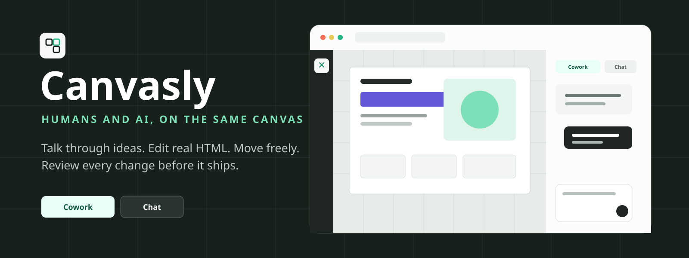
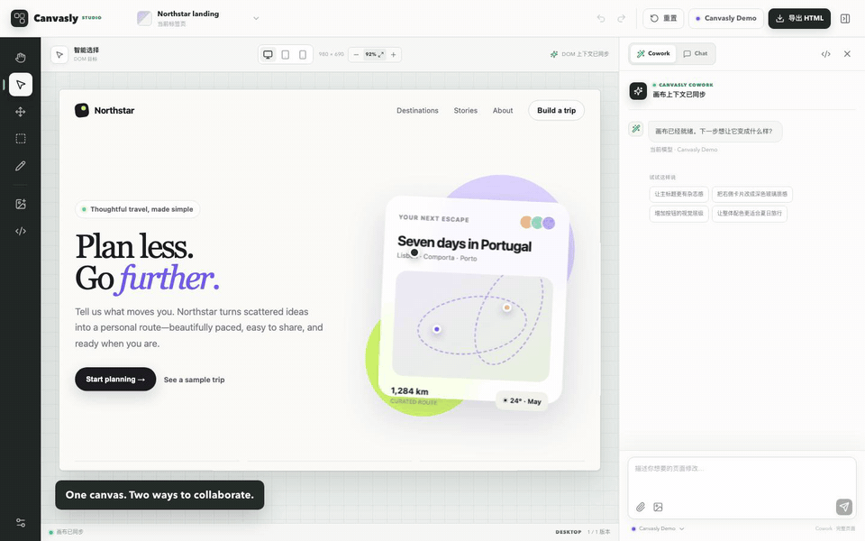
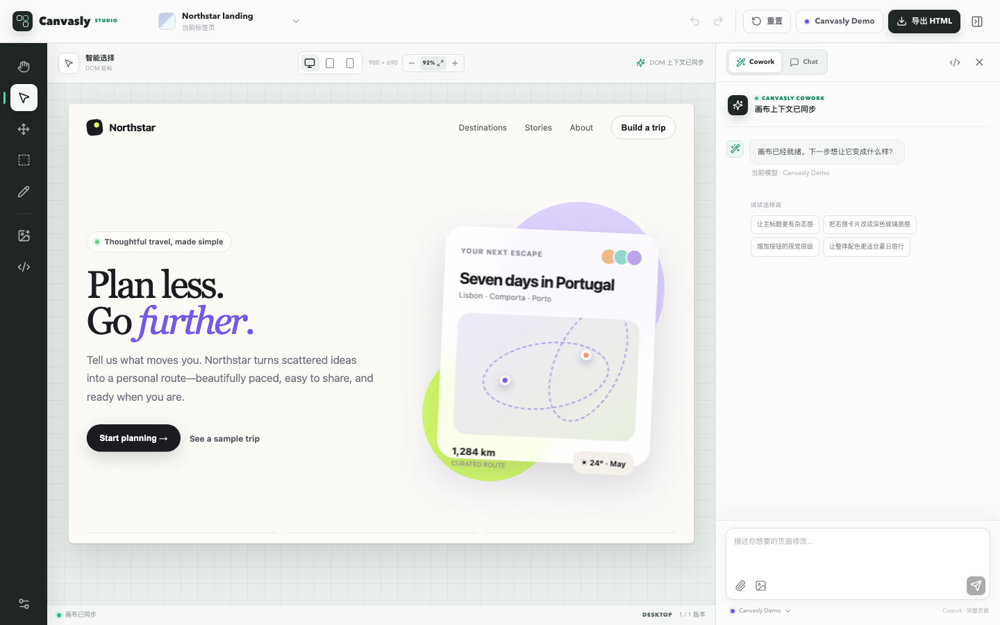
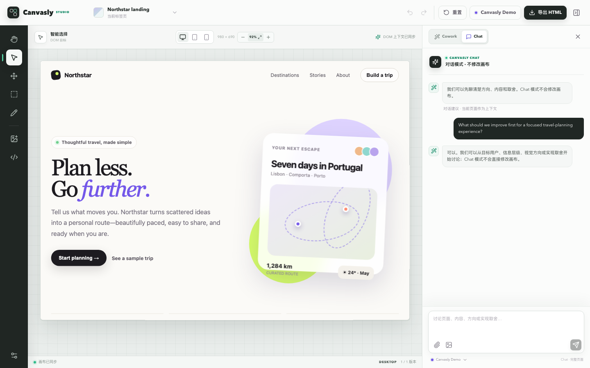
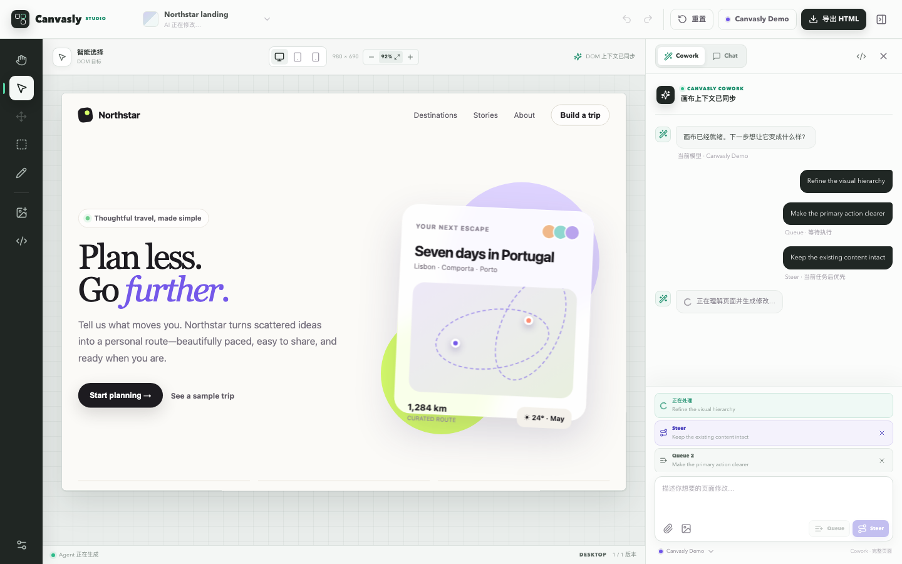
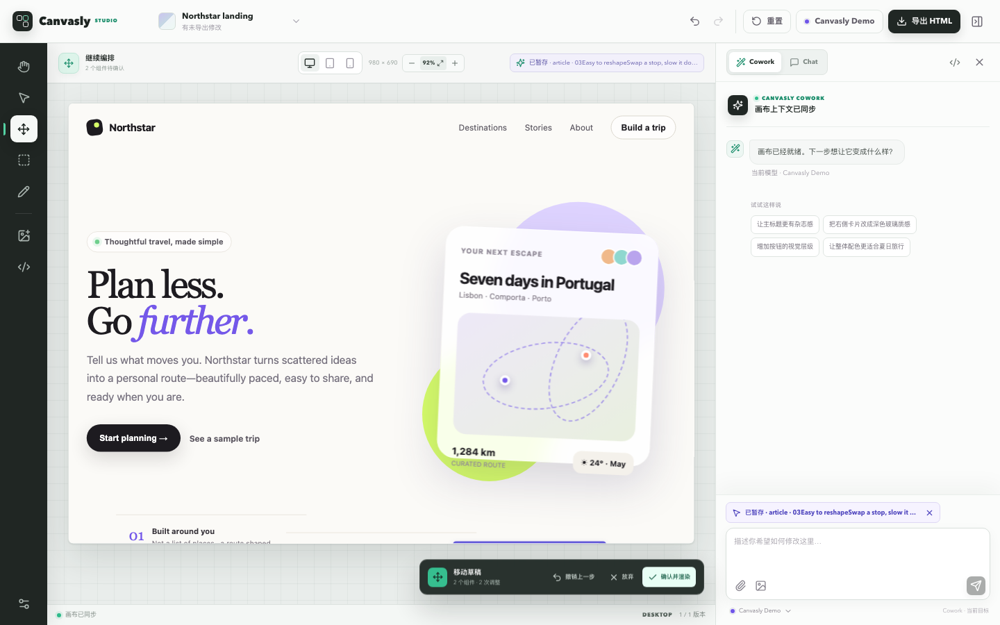
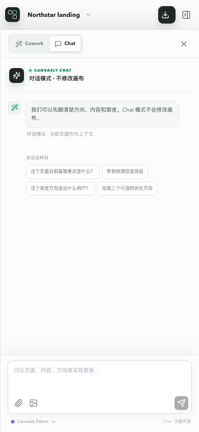
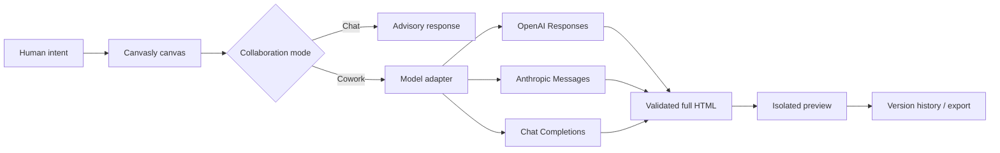

<p align="right">
  <strong>English</strong> · <a href="./README.zh-CN.md">简体中文</a>
</p>

<p align="center">
  
</p>

<p align="center">
  <strong>A visual AI workspace for talking through ideas, editing real HTML, and shipping together.</strong>
</p>

<p align="center">
  
  
  
  
  
</p>

<p align="center">
  <a href="./docs/assets/canvasly-demo.mp4"></a>
</p>

<p align="center">
  <a href="./docs/assets/canvasly-demo.mp4"><strong>Watch the full-quality MP4 demo →</strong></a>
</p>

## Why Canvasly

Most AI website tools keep you outside the work: describe a change, wait, inspect a result, repeat. Canvasly puts the human, the model, and the actual page on one shared canvas.

- **Chat before changing anything.** Discuss direction, hierarchy, content, and trade-offs without touching the canvas.
- **Cowork on real HTML.** Select an element, circle a region, sketch an intention, or attach references—then apply a reviewed full-document edit.
- **Keep steering the agent.** Type while a task runs. Use **Steer** for the next priority or **Queue** for ordered follow-ups.
- **Work directly on the page.** Interact with buttons and inputs, visually select DOM elements, and freely position multiple components before one confirmed render.
- **Stay in control.** Preview every movement, undo individual staging steps, discard a batch, or revert the final rendered version.

## Product tour

### A complete visual coworking surface



### Two modes with different promises

| Cowork | Chat |
| --- | --- |
| Generates and applies reviewed HTML edits. | Discusses the page without modifying it. |
| Selection, region, drawing, references, source editing. | Product thinking, visual critique, information architecture. |
| Creates version history with undo and redo. | Keeps a separate conversation history. |



### Agent-style follow-ups

The composer never locks while a task is running. **Steer** moves an instruction to the front of the follow-up queue; **Queue** keeps FIFO order. Each Cowork job starts from the latest completed HTML, so changes accumulate instead of overwriting one another.



### Free movement, confirmed as one change

Move several components like objects in a presentation. Canvasly stages every position live, lets you undo one adjustment or discard the whole draft, and writes the batch to HTML only after **Confirm & render**.



### Responsive by design

The canvas auto-fits around open panels. Hover over the canvas and pinch, or use `Ctrl` / `⌘` + wheel, to zoom the canvas without zooming the browser page. Desktop, tablet, and mobile previews share the same editing workflow.

<p align="center">
  
</p>

## Feature map

| Area | Capabilities |
| --- | --- |
| Collaboration | Cowork / Chat modes, independent histories, Agent status |
| Execution reports | Applied updates, partial or blocked reasons, selectable recovery options |
| Follow-ups | Editable composer while running, Steer, Queue, removable jobs |
| Prompt workflow | `↑` / `↓` terminal-style history per mode, unsent draft restore |
| Visual targeting | DOM selection, region selection, freehand annotation |
| Direct manipulation | Native page interaction, multi-component free movement, batch confirmation |
| Safe navigation | Working in-page anchors and external links, diagnostics for inert controls |
| Canvas | Auto-fit, pointer-centered local zoom, desktop/tablet/mobile sizes |
| Inputs | Images, HTML, CSS, Markdown, JSON, source code, text references |
| Recovery | Up to 30 in-session versions, undo, redo, reset, batch rollback |
| Delivery | Full HTML source editor, copy, standalone `.html` export |

## Quick start

### Desktop app — recommended for beginners

Download the installer for your system from [GitHub Releases](https://github.com/KevinYoung23/Canvasly/releases/latest):

- **macOS:** download the `.dmg`, open it, and drag Canvasly into Applications. Apple silicon and Intel Macs are supported.
- **Windows 10 / 11:** download and run the `.exe` whose name starts with `Canvasly-Setup-`.

The desktop app includes its local service, so **Docker, Node.js, and Git are not required**. It automatically saves the project and up to 30 versions on this computer; API keys still remain only in the current app session.

#### In-app updates

Use the small update button in the top bar, or open model settings and find **Canvasly Desktop** at the bottom:

1. Select **Check for updates**.
2. When a new GitHub Release is available, download it and follow the progress.
3. Select **Restart and install** when the download finishes.

Canvasly also checks shortly after launch and every six hours, but never forces a download or restart. It saves the project before installing; active Agent work or unconfirmed move drafts must be completed first.

> [!IMPORTANT]
> macOS automatic updates require Apple Developer ID signing and notarization. Production Windows installers should use a code-signing certificate. Unsigned local test packages may trigger operating-system security warnings.

### Docker one-command setup — local self-hosting

The command for your platform will:

1. Download Canvasly into a `Canvasly` folder in your home directory.
2. Detect Docker Desktop and download it from Docker when it is missing.
3. Start Docker, build Canvasly, wait for a healthy service, and open the browser.

> [!NOTE]
> This setup is for **local use**. The service listens only on `127.0.0.1`, so other devices on the LAN cannot connect directly. Docker's first-run license confirmation, a macOS password prompt, Windows WSL 2 approval, or a required restart are operating-system security steps and cannot be bypassed. If Windows requests a restart, restart it and run the same command again.

#### Windows 10 / 11

Open **PowerShell** from the Start menu, then paste and run this entire line:

```powershell
Set-ExecutionPolicy -Scope Process Bypass -Force; $installer = Join-Path $env:TEMP "canvasly-bootstrap.ps1"; Invoke-WebRequest "https://raw.githubusercontent.com/KevinYoung23/Canvasly/main/bootstrap-windows.ps1" -OutFile $installer; & $installer
```

Requires 64-bit Windows with CPU virtualization enabled and at least 8 GB RAM. The installer uses Docker's recommended per-user installation and the WSL 2 backend, requesting administrator approval to enable WSL 2 when needed. If it requests a restart, restart and run the same command to continue.

#### macOS

Open **Terminal**, then paste and run this entire line:

```bash
curl -fL --retry 3 https://raw.githubusercontent.com/KevinYoung23/Canvasly/main/bootstrap-macos.sh -o /tmp/canvasly-bootstrap.sh && bash /tmp/canvasly-bootstrap.sh
```

Supports Apple silicon and Intel Macs on a macOS release currently supported by Docker Desktop. At least 4 GB RAM is required. macOS asks for your local password while installing Docker.

The first image download and build takes longer than later starts. When setup finishes, Canvasly opens at [http://localhost:4173](http://localhost:4173). You can choose **Canvasly Demo** without an API key; to use a real AI model, open model settings, choose a provider, and enter your own API key. Projects and version history currently live only in that browser tab, so export the HTML before refreshing or closing it.

### Docker: if you already downloaded the project

You do not need to download the project again when Docker is missing. The bootstrap installer recognizes the existing Canvasly project, installs and starts Docker Desktop, and then builds the project.

#### Windows: project downloaded, Docker missing

1. Open the Canvasly project folder in File Explorer.
2. Click the address bar, type `powershell`, and press Enter.
3. Run:

```powershell
powershell -ExecutionPolicy Bypass -File .\bootstrap-windows.ps1
```

#### macOS: project downloaded, Docker missing

1. Open **Terminal**.
2. Type `cd ` (with a space after `cd`), drag the Canvasly project folder into Terminal, and press Enter.
3. Run:

```bash
bash ./bootstrap-macos.sh
```

The scripts do not download Canvasly again. Windows may request administrator approval, enable WSL 2, or require a restart; macOS asks for your local password. If a restart is required, return to the project directory afterward and run the same command again.

If the project does not contain the relevant `bootstrap-windows.ps1` or `bootstrap-macos.sh` script for your system, it is an older copy. Download the latest version from the `main` branch.

#### Docker already installed

Start Docker Desktop and wait until it reports that Docker is running, then run this from the project directory:

```bash
# macOS / Linux
bash ./install.sh

# Windows PowerShell
powershell -ExecutionPolicy Bypass -File .\install.ps1
```

### Docker: start and stop it later

Start Docker Desktop and wait until it reports that Docker is running, then use the command for your platform:

```bash
# macOS Terminal
cd ~/Canvasly
docker compose up -d
```

```powershell
# Windows PowerShell
Set-Location "$HOME\Canvasly"
docker compose up -d
```

Open [http://localhost:4173](http://localhost:4173). From the same project directory, stop the service or inspect failure logs with:

```bash
docker compose down
docker compose logs canvasly
```

If the installer says that it cannot connect to the Docker daemon, start Docker Desktop and retry. If your network times out while contacting `auth.docker.io`, seed the official Node image through its public ECR mirror:

```bash
docker pull public.ecr.aws/docker/library/node:22-alpine
docker tag public.ecr.aws/docker/library/node:22-alpine node:22-alpine
# macOS / Linux: bash ./install.sh
# Windows: powershell -ExecutionPolicy Bypass -File .\install.ps1
```

Public hosting is outside the scope of this one-command setup. Canvasly currently has no built-in account system, and Docker/browser projects and history live only in the current tab. Internet access requires authentication, HTTPS, a domain, firewall rules, and a reverse proxy at minimum, with `ALLOW_PRIVATE_LLM_ENDPOINTS=false`. Beginners should not expose this setup directly to the public internet.

### Local development

Requires Node.js 22.13 or newer.

```bash
npm ci
npm run dev
```

Open [http://127.0.0.1:5173](http://127.0.0.1:5173).

### Desktop development and packaging

```bash
npm run desktop:dev    # start Vite + Electron
npm run test:desktop   # test desktop runtime and persistence
npm run desktop:pack   # create an unpacked app for local inspection
npm run desktop:dist   # create installers for the current platform
```

Production releases use [`.github/workflows/desktop-release.yml`](./.github/workflows/desktop-release.yml). Match the `package.json` version to a tag such as `v0.2.0` or `v0.2.0-beta.1`, then push that tag. CI builds a macOS universal DMG/ZIP, Windows x64 NSIS EXE, blockmaps, and update YAML files, and uploads them to one GitHub Release. Versions containing `-beta` are published as prereleases.

Configure these GitHub Actions secrets for production signing:

| Platform | Secrets |
| --- | --- |
| macOS | `MAC_CSC_LINK`, `MAC_CSC_KEY_PASSWORD`, `APPLE_ID`, `APPLE_APP_SPECIFIC_PASSWORD`, `APPLE_TEAM_ID` |
| Windows | `WIN_CSC_LINK`, `WIN_CSC_KEY_PASSWORD` |

## Connect a model

Open model settings in the editor. Credentials stay in the current browser session and are sent only to the Canvasly server handling that request.

| Provider | Protocol | Default endpoint |
| --- | --- | --- |
| OpenAI | Responses API | `https://api.openai.com/v1` |
| Anthropic Claude | Messages API | `https://api.anthropic.com` |
| Qwen | Chat Completions | `https://dashscope.aliyuncs.com/compatible-mode/v1` |
| DeepSeek | Chat Completions | `https://api.deepseek.com` |
| GitHub Copilot | Responses / local bridge | Desktop `http://127.0.0.1:4141/v1`; Docker `http://host.docker.internal:4141/v1` |
| Local models | Chat Completions | Desktop `http://127.0.0.1:11434/v1`; Docker `http://host.docker.internal:11434/v1` |
| Custom endpoint | Responses or Chat Completions | `http://127.0.0.1:4141/v1` |

### Local Custom endpoint

The Custom endpoint preset is ready for a local Responses-compatible service:

```text
Protocol:  Responses API
Base URL:  http://127.0.0.1:4141/v1
Model:     gpt-5.5
API key:   empty
```

You can switch the same preset to Chat Completions for compatible gateways.

The bundled Docker setup binds Canvasly to `127.0.0.1` and allows trusted localhost, Docker-host, and private-network model endpoints by default. Set `ALLOW_PRIVATE_LLM_ENDPOINTS=false` before exposing Canvasly beyond your machine, then restart the service.

### GitHub Copilot login

Canvasly includes a dual-protocol bridge built on the official `@github/copilot-sdk`.

To reuse a GitHub Copilot CLI login without copying a token, run the bridge on the host:

```bash
npm ci
copilot login
npm run copilot:bridge
```

Run `npm run dev` in another terminal, or enable `ALLOW_PRIVATE_LLM_ENDPOINTS=true` in `.env` when the Canvasly app runs in Docker.

To run both services in Docker, set these values in the ignored `.env` file, then start the Copilot profile:

```dotenv
ALLOW_PRIVATE_LLM_ENDPOINTS=true
COPILOT_GITHUB_TOKEN=your-token
```

```bash
./install.sh --copilot
```

The container does not inherit the host CLI login, so `--copilot` requires `COPILOT_GITHUB_TOKEN`. Confirm either bridge path at [http://127.0.0.1:4141/health](http://127.0.0.1:4141/health); `authenticated` must be `true` before sending a request.

## How it works



1. Canvasly captures the current HTML, instruction, selected context, and references.
2. The adapter builds a provider-specific request.
3. Chat returns advice only. Cowork must return a complete standalone document.
4. Canvasly validates the result, removes internal targeting markers, and commits one version.
5. The preview runs in a sandbox with scripts disabled; exported HTML keeps the final source.

## Safety model

- API keys are never written to local storage, logs, or project files.
- The desktop app binds its bundled service to a random `127.0.0.1` port and writes project state to the operating system's app-data directory.
- Desktop updates accept GitHub Release checksum metadata; production releases should additionally rely on macOS and Windows code signing.
- Remote model endpoints must use HTTPS.
- The bundled Compose stack binds to `127.0.0.1` and permits trusted local/private endpoints for local use.
- Before exposing Canvasly beyond the local machine, operators must set `ALLOW_PRIVATE_LLM_ENDPOINTS=false` and enforce outbound network policy for custom DNS hostnames.
- Redirects are rejected and request, HTML, attachment, and image sizes are bounded.
- Preview scripts and refresh redirects are removed before rendering.
- The iframe uses CSP plus sandbox isolation and does not execute generated JavaScript.
- Stale Agent responses cannot overwrite a newer local edit or source draft.

## Project layout

```text
app/
  api/transform/route.ts   provider adapters, validation, endpoint security
  desktop-api.ts           Electron bridge types and update state
  editor-data.ts           presets, starter HTML, prompt suggestions
  page.tsx                 canvas, collaboration modes, Agent queue, history
  globals.css              responsive workbench and interaction styling
desktop/
  main.mjs                 window, local server, persistence, and updater
  preload.cjs              minimal-privilege IPC bridge
  build.mjs                cross-platform standalone build
  bundle.mjs               minimal Electron main-process bundle
tools/
  copilot-bridge.mjs       optional logged-in GitHub Copilot SDK bridge
docs/assets/               screenshots, banner, GIF, and promotional video
worker/index.ts            Cloudflare/Vinext Worker entry
electron-builder.yml       DMG / ZIP / NSIS and GitHub update configuration
.github/workflows/
  desktop-release.yml      cross-platform Release automation
bootstrap-macos.sh         New-computer installer for macOS
bootstrap-windows.ps1      New-computer installer for Windows
install.sh / install.ps1   Project-local Docker installers
compose.yaml               Self-hosted services
```

## Development checks

```bash
npm run lint
npm test
npm run test:desktop
node --check tools/copilot-bridge.mjs
```

### End-to-end suites

Start the Docker app before running E2E tests. Browser tests use an installed Microsoft Edge, Google Chrome, or Chromium through `playwright-core` and do not download another browser.

```bash
./install.sh
npm run test:api       # 12 deterministic API contract cases
npm run test:browser   # 12 deterministic UI and workflow cases
npm run test:model     # 14 real local gpt-5.5 cases, including one browser flow
npm run test:e2e       # all three suites in sequence
```

`test:model` expects the Responses-compatible endpoint at `http://host.docker.internal:4141/v1` with model `gpt-5.5`. Override it with `CANVASLY_MODEL_ENDPOINT` and `CANVASLY_MODEL`. The run report is written to `.sites-runtime/test-reports/local-model.json`.

On macOS, `npm test` requires GNU `timeout`; the equivalent underlying validation is:

```bash
bash scripts/sites-env.sh -- ./node_modules/.bin/vinext build
bash scripts/validate-artifact.sh
node --test tests/rendered-html.test.mjs
```

## Current scope

The desktop app automatically stores projects and version history on the local computer. Docker/browser sessions still live only in the current tab. Cloud synchronization, collaborative multiplayer editing, reusable component libraries, and a visual property inspector remain future work.

---

<p align="center">
  Built for the moment where conversation becomes a real, reviewable interface.
</p>
