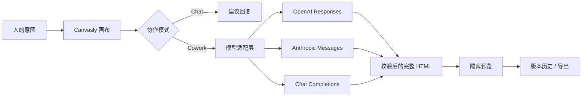

<p align="right">
  <a href="./README.md">English</a> · <strong>简体中文</strong>
</p>

<p align="center">
  
</p>

<p align="center">
  <strong>一个用于讨论想法、编辑真实 HTML，并与 AI 一起完成交付的可视化工作台。</strong>
</p>

<p align="center">
  
  
  
  
  
</p>

<p align="center">
  <a href="./docs/assets/canvasly-demo.mp4"></a>
</p>

<p align="center">
  <a href="./docs/assets/canvasly-demo.mp4"><strong>观看高清 MP4 演示 →</strong></a>
</p>

## 为什么是 Canvasly

多数 AI 网页工具把人挡在工作之外：描述需求、等待、检查结果，然后重复。Canvasly 把人、模型与真实页面放在同一张画布上。

- **先聊清楚，再决定是否修改。** Chat 模式可以讨论方向、层级、内容与取舍，但不会触碰画布。
- **在真实 HTML 上协作。** Cowork 模式支持元素选择、圈选、手绘、附件和源码编辑，并应用经过校验的完整文档修改。
- **任务运行中继续跟进。** 输入框不会锁定；使用 **Steer** 把下一条指令提升为最高优先级，或用 **Queue** 按顺序排队。
- **直接操作页面。** 点击按钮、编辑输入框、选择 DOM 元素，并像 PPT 一样自由移动多个组件。
- **始终保留控制权。** 实时预览移动、撤销暂存步骤、放弃整批调整，或撤销最终渲染版本。

## 产品导览

### 完整的可视化协作界面


### 两种模式，两种明确承诺

| Cowork | Chat |
| --- | --- |
| 生成并应用经过检查的 HTML 修改。 | 只讨论页面，不修改画布。 |
| 支持选择、圈选、手绘、附件和源码。 | 适合产品思考、视觉评审与信息架构讨论。 |
| 创建可撤销、可重做的版本历史。 | 拥有独立的对话历史。 |


### Agent 式消息跟进

任务运行时仍可继续输入。**Steer** 会让某条指令在当前任务结束后优先执行；**Queue** 保持 FIFO 顺序。每个 Cowork 任务都从最新 HTML 开始，因此修改会持续累积，而不是互相覆盖。


### 自由移动，一次确认

像演示文稿一样连续移动多个组件。Canvasly 会实时暂存每个位置，允许撤销单步或放弃整批草稿；只有点击“确认并渲染”后，才会统一写入 HTML。


### 从桌面到移动端

左右面板展开时，画布会自动适配。光标位于画布时，可使用触控板捏合或 `Ctrl` / `⌘` + 滚轮局部缩放，而不会改变浏览器网页比例。桌面、平板和手机预览共享同一套编辑流程。

<p align="center">
  
</p>

## 功能地图

| 模块 | 能力 |
| --- | --- |
| 协作 | Cowork / Chat、独立消息历史、Agent 状态 |
| 跟进 | 运行中可输入、Steer、Queue、可移除任务 |
| 指令流 | 各模式独立的 `↑` / `↓` 历史、未发送草稿恢复 |
| 视觉定位 | DOM 选择、区域圈选、手绘标注 |
| 直接操作 | 页面原生交互、多组件自由移动、整批确认 |
| 画布 | 自动适配、光标中心局部缩放、桌面/平板/手机尺寸 |
| 输入 | 图片、HTML、CSS、Markdown、JSON、源码和文本参考 |
| 恢复 | 最多 30 个会话版本、撤销、重做、重置、批量回滚 |
| 交付 | 完整 HTML 源码编辑、复制、独立 `.html` 导出 |

## 快速开始

### Docker — 推荐

先安装并启动 [Docker Desktop](https://www.docker.com/products/docker-desktop/)。等待界面显示 Docker 正在运行，然后执行：

```bash
# macOS / Linux
./install.sh

# Windows PowerShell
powershell -ExecutionPolicy Bypass -File .\install.ps1
```

Canvasly 将打开在 [http://localhost:4173](http://localhost:4173)。

```bash
docker compose up -d   # 再次启动
docker compose down    # 停止
```

如果安装器提示无法连接 Docker daemon，请先启动 Docker Desktop 后重试。如果当前网络连接 `auth.docker.io` 超时，可通过公共 ECR 镜像预拉取官方 Node 镜像：

```bash
docker pull public.ecr.aws/docker/library/node:22-alpine
docker tag public.ecr.aws/docker/library/node:22-alpine node:22-alpine
./install.sh
```

### 本地开发

需要 Node.js 22.13 或更高版本。

```bash
npm ci
npm run dev
```

打开 [http://127.0.0.1:5173](http://127.0.0.1:5173)。

## 连接模型

在编辑器中打开模型设置。密钥只存在于当前浏览器会话中，并仅发送给处理本次请求的 Canvasly 服务。

| 服务 | 协议 | 默认节点 |
| --- | --- | --- |
| OpenAI | Responses API | `https://api.openai.com/v1` |
| Anthropic Claude | Messages API | `https://api.anthropic.com` |
| Qwen | Chat Completions | `https://dashscope.aliyuncs.com/compatible-mode/v1` |
| DeepSeek | Chat Completions | `https://api.deepseek.com` |
| GitHub Copilot | Responses / 本地 bridge | `http://host.docker.internal:4141/v1` |
| 本地模型 | Chat Completions | `http://host.docker.internal:11434/v1` |
| 自定义节点 | Responses 或 Chat Completions | `http://127.0.0.1:4141/v1` |

### 本地 Custom endpoint

自定义节点默认可直接连接本机 Responses-compatible 服务：

```text
协议：     Responses API
Base URL： http://127.0.0.1:4141/v1
模型：     gpt-5.5
API key：  留空
```

如果网关只支持 Chat Completions，可在同一个预设中切换协议。

随附的 Docker 配置只将 Canvasly 绑定到 `127.0.0.1`，因此默认允许访问可信的 localhost、Docker 宿主机与私有网络模型节点。将 Canvasly 暴露到本机之外前，请在 `.env` 中设置 `ALLOW_PRIVATE_LLM_ENDPOINTS=false` 并重启服务。

### GitHub Copilot 登录

Canvasly 提供基于官方 `@github/copilot-sdk`、同时兼容两种协议的 bridge。

如需直接复用 GitHub Copilot CLI 登录态而不复制 token，请在宿主机运行 bridge：

```bash
npm ci
copilot login
npm run copilot:bridge
```

请在另一个终端运行 `npm run dev`；如果 Canvasly 应用运行在 Docker 中，则还需在 `.env` 中启用 `ALLOW_PRIVATE_LLM_ENDPOINTS=true`。

如需让应用和 bridge 都运行在 Docker 中，请先在已被忽略的 `.env` 文件中设置：

```dotenv
ALLOW_PRIVATE_LLM_ENDPOINTS=true
COPILOT_GITHUB_TOKEN=your-token
```

然后启动 Copilot profile：

```bash
./install.sh --copilot
```

容器不会继承宿主机 CLI 登录态，因此 `--copilot` 必须提供 `COPILOT_GITHUB_TOKEN`。两种路径都可以通过 [http://127.0.0.1:4141/health](http://127.0.0.1:4141/health) 检查；发送请求前，`authenticated` 必须为 `true`。

## 工作原理



1. Canvasly 收集当前 HTML、用户指令、选区上下文与附件。
2. 适配层生成不同供应商所需的请求。
3. Chat 只返回建议；Cowork 必须返回完整、独立的 HTML 文档。
4. Canvasly 校验结果、清理内部定位标记，并提交一个新版本。
5. 预览在禁用脚本的 sandbox 中运行；导出时保留最终源码。

## 安全边界

- API 密钥不会写入 localStorage、日志或项目文件。
- 远程模型节点必须使用 HTTPS。
- 随附的 Compose 配置仅绑定 `127.0.0.1`，并允许本地使用可信的本地或私有节点。
- 将 Canvasly 暴露到本机之外前，运维者必须设置 `ALLOW_PRIVATE_LLM_ENDPOINTS=false`，并针对自定义 DNS 域名配置出站网络策略。
- 拒绝远程重定向，并限制请求、HTML、附件与图片大小。
- 渲染前移除脚本与刷新重定向。
- iframe 使用 CSP 与 sandbox 隔离，不执行生成的 JavaScript。
- 过期 Agent 响应不会覆盖较新的本地编辑或源码草稿。

## 项目结构

```text
app/
  api/transform/route.ts   模型适配、结果校验、节点安全
  editor-data.ts           模型预设、示例 HTML、提示建议
  page.tsx                 画布、协作模式、Agent 队列、版本历史
  globals.css              响应式工作台与交互样式
tools/
  copilot-bridge.mjs       可选的 GitHub Copilot 登录态 bridge
docs/assets/               截图、封面、GIF 与宣传视频
worker/index.ts            Cloudflare/Vinext Worker 入口
compose.yaml               自托管服务
```

## 开发检查

```bash
npm run lint
npm test
node --check tools/copilot-bridge.mjs
```

macOS 上 `npm test` 需要 GNU `timeout`；等价的底层验证命令为：

```bash
bash scripts/sites-env.sh -- ./node_modules/.bin/vinext build
bash scripts/validate-artifact.sh
node --test tests/rendered-html.test.mjs
```

## 当前范围

Canvasly 目前把项目与版本历史保存在当前浏览器会话中；刷新后会回到示例页面。云端项目持久化、多人实时协作、可复用组件库和可视化属性面板属于后续方向。

---

<p align="center">
  为“对话真正变成可检查界面”的那一刻而构建。
</p>
