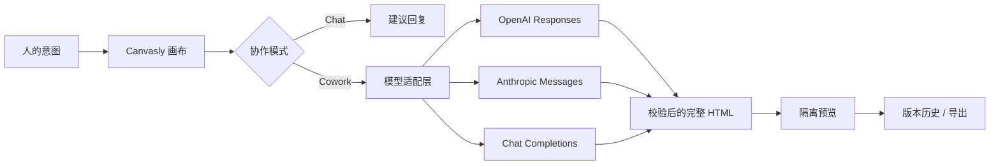

<p align="right">
  <a href="./README.md">English</a> · <strong>简体中文</strong>
</p>

<p align="center">
  
</p>

<p align="center">
  <strong>一个用于讨论想法、编辑真实 HTML，并与 AI 一起完成交付的可视化工作台。</strong>
</p>

<p align="center">
  
  
  
  
  
</p>

<p align="center">
  <a href="./docs/assets/canvasly-demo.mp4"></a>
</p>

<p align="center">
  <a href="./docs/assets/canvasly-demo.mp4"><strong>观看高清 MP4 演示 →</strong></a>
</p>

## 为什么是 Canvasly

多数 AI 网页工具把人挡在工作之外：描述需求、等待、检查结果，然后重复。Canvasly 把人、模型与真实页面放在同一张画布上。

- **先聊清楚，再决定是否修改。** Chat 模式可以讨论方向、层级、内容与取舍，但不会触碰画布。
- **在真实 HTML 上协作。** Cowork 模式支持元素选择、圈选、手绘、附件和源码编辑，并应用经过校验的完整文档修改。
- **任务运行中继续跟进。** 输入框不会锁定；使用 **Steer** 把下一条指令提升为最高优先级，或用 **Queue** 按顺序排队。
- **直接操作页面。** 点击按钮、编辑输入框、选择 DOM 元素，并像 PPT 一样自由移动多个组件。
- **始终保留控制权。** 实时预览移动、撤销暂存步骤、放弃整批调整，或撤销最终渲染版本。

## 产品导览

### 完整的可视化协作界面


### 两种模式，两种明确承诺

| Cowork | Chat |
| --- | --- |
| 生成并应用经过检查的 HTML 修改。 | 只讨论页面，不修改画布。 |
| 支持选择、圈选、手绘、附件和源码。 | 适合产品思考、视觉评审与信息架构讨论。 |
| 创建可撤销、可重做的版本历史。 | 拥有独立的对话历史。 |


### Agent 式消息跟进

任务运行时仍可继续输入。**Steer** 会让某条指令在当前任务结束后优先执行；**Queue** 保持 FIFO 顺序。每个 Cowork 任务都从最新 HTML 开始，因此修改会持续累积，而不是互相覆盖。


### 自由移动，一次确认

像演示文稿一样连续移动多个组件。Canvasly 会实时暂存每个位置，允许撤销单步或放弃整批草稿；只有点击“确认并渲染”后，才会统一写入 HTML。


### 从桌面到移动端

左右面板展开时，画布会自动适配。光标位于画布时，可使用触控板捏合或 `Ctrl` / `⌘` + 滚轮局部缩放，而不会改变浏览器网页比例。桌面、平板和手机预览共享同一套编辑流程。

<p align="center">
  
</p>

## 功能地图

| 模块 | 能力 |
| --- | --- |
| 协作 | Cowork / Chat、独立消息历史、Agent 状态 |
| 执行报告 | 已应用更新、部分完成或阻塞原因、可选择的解决方案 |
| 跟进 | 运行中可输入、Steer、Queue、可移除任务 |
| 指令流 | 各模式独立的 `↑` / `↓` 历史、未发送草稿恢复 |
| 视觉定位 | DOM 选择、区域圈选、手绘标注 |
| 直接操作 | 页面原生交互、多组件自由移动、整批确认 |
| 安全导航 | 可用的页内锚点与外部链接、无效控件诊断 |
| 画布 | 自动适配、光标中心局部缩放、桌面/平板/手机尺寸 |
| 输入 | 图片、HTML、CSS、Markdown、JSON、源码和文本参考 |
| 恢复 | 最多 30 个会话版本、撤销、重做、重置、批量回滚 |
| 交付 | 完整 HTML 源码编辑、复制、独立 `.html` 导出 |

## 快速开始

### 桌面应用 — 推荐小白

从 [GitHub Releases](https://github.com/KevinYoung23/Canvasly/releases) 下载自己系统的安装包：

- **macOS：** 下载 `.dmg`，打开后把 Canvasly 拖入“应用程序”。同时支持 Apple 芯片和 Intel 芯片。
- **Windows 10 / 11：** 下载名称以 `Canvasly-Setup-` 开头的 `.exe` 并双击安装。

桌面版已经内置本地服务，**不需要安装 Docker、Node.js 或 Git**。项目、最多 30 个版本，以及上次使用的服务商、协议、节点地址和模型名会自动保存在这台电脑中；API 密钥仍只保留在当前应用会话。若异常结果让画布变空，重启时会自动恢复最近的可见版本，同时保留独立的源码草稿；也可从项目菜单选择“恢复示例页面”。

#### 应用内更新

点击顶部的更新小按钮，或打开右上角“模型设置”并在窗口底部找到 **Canvasly 桌面版**：

1. 点击“检查更新”。
2. 发现 GitHub Release 新版本后，点击下载并查看进度。
3. 下载完成后点击“重启并安装”。

Canvasly 启动后也会自动检查，并每 6 小时重新检查一次，但不会强制下载或重启。安装更新前会保存项目；Agent 正在运行或还有未确认的移动草稿时，应用会要求先处理完成。

> [!IMPORTANT]
> macOS 自动更新要求安装包经过 Apple Developer ID 签名和公证，Windows 正式包应使用代码签名证书。未签名的本地测试包可能显示系统安全警告。

### Docker 一键安装 — 本机自托管

下面的一条命令会自动完成这些工作：

1. 把 Canvasly 下载到用户目录下的 `Canvasly` 文件夹。
2. 检测 Docker Desktop；没有安装时，从 Docker 官网下载并安装。
3. 启动 Docker、构建 Canvasly，并在服务健康后打开浏览器。

> [!NOTE]
> 一键安装用于**本机使用**，服务只监听 `127.0.0.1`，同一局域网中的其他设备也无法直接访问。Docker 首次运行时的许可确认、macOS 密码、Windows WSL 2 授权或系统重启属于系统安全步骤，脚本不能代替你确认；如 Windows 要求重启，重启后再次执行同一条命令即可。

#### Windows 10 / 11

打开开始菜单中的 **PowerShell**，复制并执行整行命令：

```powershell
Set-ExecutionPolicy -Scope Process Bypass -Force; $installer = Join-Path $env:TEMP "canvasly-bootstrap.ps1"; Invoke-WebRequest "https://raw.githubusercontent.com/KevinYoung23/Canvasly/main/bootstrap-windows.ps1" -OutFile $installer; & $installer
```

要求 64 位 Windows、已开启 CPU 虚拟化并至少有 8 GB 内存。安装器使用 Docker 官方推荐的当前用户安装模式和 WSL 2 后端，并会在需要时请求管理员授权来启用 WSL 2；如果提示重启，重启后执行同一条命令即可继续。

#### macOS

打开 **终端（Terminal）**，复制并执行整行命令：

```bash
curl -fL --retry 3 https://raw.githubusercontent.com/KevinYoung23/Canvasly/main/bootstrap-macos.sh -o /tmp/canvasly-bootstrap.sh && bash /tmp/canvasly-bootstrap.sh
```

支持 Docker Desktop 当前支持的 macOS 版本和 Apple 芯片 / Intel 芯片，最低需要 4 GB 内存。安装 Docker 时 macOS 会要求输入本机密码。

第一次下载镜像并构建通常比以后启动慢。完成后，Canvasly 会打开在 [http://localhost:4173](http://localhost:4173)。无需 API 密钥也可先选择 **Canvasly Demo** 体验；使用真实 AI 时，再到右上角的模型设置中选择服务商并填写自己的 API 密钥。当前项目和版本历史只保留在这个浏览器标签页中，刷新或关闭前请导出 HTML。

### Docker：已经下载了项目

即使还没有安装 Docker，也不需要重新下载项目。引导安装器会识别当前 Canvasly 项目，自动安装并启动 Docker Desktop，然后构建项目。

#### Windows：项目已有，Docker 未安装

1. 在文件资源管理器中打开 Canvasly 项目文件夹。
2. 点击地址栏，输入 `powershell`，按回车。
3. 在打开的窗口中执行：

```powershell
powershell -ExecutionPolicy Bypass -File .\bootstrap-windows.ps1
```

#### macOS：项目已有，Docker 未安装

1. 打开“终端（Terminal）”。
2. 输入 `cd `（`cd` 后留一个空格），把 Canvasly 项目文件夹拖进终端，按回车。
3. 执行：

```bash
bash ./bootstrap-macos.sh
```

脚本不会重复下载 Canvasly。Windows 可能要求管理员授权、启用 WSL 2 或重启；macOS 会要求输入本机密码。如果系统要求重启，重启后回到项目目录执行同一条命令即可继续。

如果项目中看不到自己系统对应的 `bootstrap-windows.ps1` 或 `bootstrap-macos.sh`，说明它是旧版本，请从 `main` 分支重新下载最新版。

#### Docker 已安装

先启动 Docker Desktop 并等待它显示正在运行，再在项目目录中执行：

```bash
# macOS / Linux
bash ./install.sh

# Windows PowerShell
powershell -ExecutionPolicy Bypass -File .\install.ps1
```

### Docker：再次启动与停止

以后使用时，先打开 Docker Desktop，等待它显示正在运行，再执行对应命令：

```bash
# macOS 终端
cd ~/Canvasly
docker compose up -d
```

```powershell
# Windows PowerShell
Set-Location "$HOME\Canvasly"
docker compose up -d
```

浏览器访问 [http://localhost:4173](http://localhost:4173)。在同一个项目目录中，可用下面的命令停止服务或查看故障日志：

```bash
docker compose down
docker compose logs canvasly
```

如果安装器提示无法连接 Docker daemon，请先启动 Docker Desktop 后重试。如果当前网络连接 `auth.docker.io` 超时，可通过公共 ECR 镜像预拉取官方 Node 镜像：

```bash
docker pull public.ecr.aws/docker/library/node:22-alpine
docker tag public.ecr.aws/docker/library/node:22-alpine node:22-alpine
# macOS / Linux：bash ./install.sh
# Windows：powershell -ExecutionPolicy Bypass -File .\install.ps1
```

公网部署不属于上述一键安装范围。Canvasly 当前没有内置账号系统；Docker / 浏览器版本的项目与历史只保存在当前标签页中。如需让其他人通过互联网访问，至少还要配置身份验证、HTTPS、域名、防火墙和反向代理，并将 `ALLOW_PRIVATE_LLM_ENDPOINTS=false`。不建议零基础用户直接把它暴露到公网。

### 本地开发

需要 Node.js 22.13 或更高版本。

```bash
npm ci
npm run dev
```

打开 [http://127.0.0.1:5173](http://127.0.0.1:5173)。

### 桌面版开发与打包

```bash
npm run desktop:dev    # 启动 Vite + Electron
npm run test:desktop   # 桌面运行时与持久化测试
npm run test:desktop-app # 真实 Electron 退出/重启恢复测试
npm run desktop:pack   # 生成未压缩应用，便于本机检查
npm run desktop:dist   # 生成当前系统的安装包
```

生产发布由 [`.github/workflows/desktop-release.yml`](./.github/workflows/desktop-release.yml) 完成。先让 `package.json` 的版本与标签一致，再推送 `v0.2.0` 或 `v0.2.0-beta.1` 这类标签。CI 会分别构建 macOS universal DMG/ZIP、Windows x64 NSIS EXE、blockmap 和更新 YAML，并上传到同一个 GitHub Release。带 `-beta` 的版本会发布为预发布版本。

正式签名需要在 GitHub Actions 中配置：

| 平台 | Secrets |
| --- | --- |
| macOS | `MAC_CSC_LINK`、`MAC_CSC_KEY_PASSWORD`、`APPLE_ID`、`APPLE_APP_SPECIFIC_PASSWORD`、`APPLE_TEAM_ID` |
| Windows | `WIN_CSC_LINK`、`WIN_CSC_KEY_PASSWORD` |

## 连接模型

在编辑器中打开模型设置。桌面版会记住服务商、协议、节点地址和模型名；密钥只存在于当前应用会话中，并仅发送给处理本次请求的 Canvasly 服务。

| 服务 | 协议 | 默认节点 |
| --- | --- | --- |
| OpenAI | Responses API | `https://api.openai.com/v1` |
| Anthropic Claude | Messages API | `https://api.anthropic.com` |
| Qwen | Chat Completions | `https://dashscope.aliyuncs.com/compatible-mode/v1` |
| DeepSeek | Chat Completions | `https://api.deepseek.com` |
| GitHub Copilot | Responses / 本地 bridge | 桌面 `http://127.0.0.1:4141/v1`；Docker `http://host.docker.internal:4141/v1` |
| 本地模型 | Chat Completions | 桌面 `http://127.0.0.1:11434/v1`；Docker `http://host.docker.internal:11434/v1` |
| 自定义节点 | Responses 或 Chat Completions | `http://127.0.0.1:4141/v1` |

### 本地 Custom endpoint

自定义节点默认可直接连接本机 Responses-compatible 服务：

```text
协议：     Responses API
Base URL： http://127.0.0.1:4141/v1
模型：     gpt-5.5
API key：  留空
```

如果网关只支持 Chat Completions，可在同一个预设中切换协议。

随附的 Docker 配置只将 Canvasly 绑定到 `127.0.0.1`，因此默认允许访问可信的 localhost、Docker 宿主机与私有网络模型节点。将 Canvasly 暴露到本机之外前，请在 `.env` 中设置 `ALLOW_PRIVATE_LLM_ENDPOINTS=false` 并重启服务。

### GitHub Copilot 登录

Canvasly 提供基于官方 `@github/copilot-sdk`、同时兼容两种协议的 bridge。

如需直接复用 GitHub Copilot CLI 登录态而不复制 token，请在宿主机运行 bridge：

```bash
npm ci
copilot login
npm run copilot:bridge
```

请在另一个终端运行 `npm run dev`；如果 Canvasly 应用运行在 Docker 中，则还需在 `.env` 中启用 `ALLOW_PRIVATE_LLM_ENDPOINTS=true`。

如需让应用和 bridge 都运行在 Docker 中，请先在已被忽略的 `.env` 文件中设置：

```dotenv
ALLOW_PRIVATE_LLM_ENDPOINTS=true
COPILOT_GITHUB_TOKEN=your-token
```

然后启动 Copilot profile：

```bash
./install.sh --copilot
```

容器不会继承宿主机 CLI 登录态，因此 `--copilot` 必须提供 `COPILOT_GITHUB_TOKEN`。两种路径都可以通过 [http://127.0.0.1:4141/health](http://127.0.0.1:4141/health) 检查；发送请求前，`authenticated` 必须为 `true`。

## 工作原理



1. Canvasly 收集当前 HTML、用户指令、选区上下文与附件。
2. 适配层生成不同供应商所需的请求。
3. Chat 只返回建议；Cowork 必须返回完整、独立的 HTML 文档。
4. Canvasly 校验结果、清理内部定位标记，并提交一个新版本。
5. 预览在禁用脚本的 sandbox 中运行；导出时保留最终源码。

## 安全边界

- API 密钥不会写入 localStorage、日志或项目文件。
- 桌面版只在随机 `127.0.0.1` 端口启动内置服务，项目状态写入系统应用数据目录。
- 桌面更新只接受 GitHub Release 生成的校验元数据；正式发布应同时依赖 macOS / Windows 代码签名。
- 远程模型节点必须使用 HTTPS。
- 随附的 Compose 配置仅绑定 `127.0.0.1`，并允许本地使用可信的本地或私有节点。
- 将 Canvasly 暴露到本机之外前，运维者必须设置 `ALLOW_PRIVATE_LLM_ENDPOINTS=false`，并针对自定义 DNS 域名配置出站网络策略。
- 拒绝远程重定向，并限制请求、HTML、附件与图片大小。
- 渲染前移除脚本与刷新重定向。
- iframe 使用 CSP 与 sandbox 隔离，不执行生成的 JavaScript。
- 过期 Agent 响应不会覆盖较新的本地编辑或源码草稿。

## 项目结构

```text
app/
  api/transform/route.ts   模型适配、结果校验、节点安全
  desktop-api.ts           Electron 安全桥类型与更新状态
  editor-data.ts           模型预设、示例 HTML、提示建议
  page.tsx                 画布、协作模式、Agent 队列、版本历史
  globals.css              响应式工作台与交互样式
desktop/
  main.mjs                 桌面窗口、本地服务、持久化与更新
  preload.cjs              最小权限 IPC 安全桥
  build.mjs                跨平台 standalone 构建
  bundle.mjs               精简 Electron 主进程打包
tools/
  copilot-bridge.mjs       可选的 GitHub Copilot 登录态 bridge
docs/assets/               截图、封面、GIF 与宣传视频
worker/index.ts            Cloudflare/Vinext Worker 入口
electron-builder.yml       DMG / ZIP / NSIS 打包与 GitHub 更新配置
.github/workflows/
  desktop-release.yml      跨平台 Release 自动构建
bootstrap-macos.sh         macOS 新电脑一键安装
bootstrap-windows.ps1      Windows 新电脑一键安装
install.sh / install.ps1   项目内 Docker 安装入口
compose.yaml               自托管服务
```

## 开发检查

```bash
npm run lint
npm test
npm run test:desktop
node --check tools/copilot-bridge.mjs
```

### 端到端测试

运行 E2E 前请先启动 Docker 应用。浏览器测试通过 `playwright-core` 复用本机已安装的 Microsoft Edge、Google Chrome 或 Chromium，不会额外下载浏览器。

```bash
./install.sh
npm run test:api       # 16 个确定性 API 契约 case
npm run test:browser   # 15 个确定性 UI 与工作流 case
npm run test:model     # 19 个真实本地 gpt-5.5 场景，共 25 次请求
npm run test:e2e       # 依次运行以上三套测试
```

`test:model` 默认在 Docker 中连接 `http://host.docker.internal:4141/v1` 的 Responses-compatible 服务并使用 `gpt-5.5`；直接运行 standalone 时使用 `CANVASLY_MODEL_ENDPOINT=http://127.0.0.1:4141/v1`。测试覆盖页面创建、组件编辑、定点插入、手绘上下文、长页面、连续修改、并发、导航、安全和真实浏览器链路，报告写入 `.sites-runtime/test-reports/local-model.json`。

macOS 上 `npm test` 需要 GNU `timeout`；等价的底层验证命令为：

```bash
bash scripts/sites-env.sh -- ./node_modules/.bin/vinext build
bash scripts/validate-artifact.sh
node --test tests/rendered-html.test.mjs
```

## 当前范围

桌面版会在本机自动保存项目与版本历史，Docker / 浏览器版本仍只保存在当前标签页中。云端项目同步、多人实时协作、可复用组件库和可视化属性面板属于后续方向。

---

<p align="center">
  为“对话真正变成可检查界面”的那一刻而构建。
</p>
